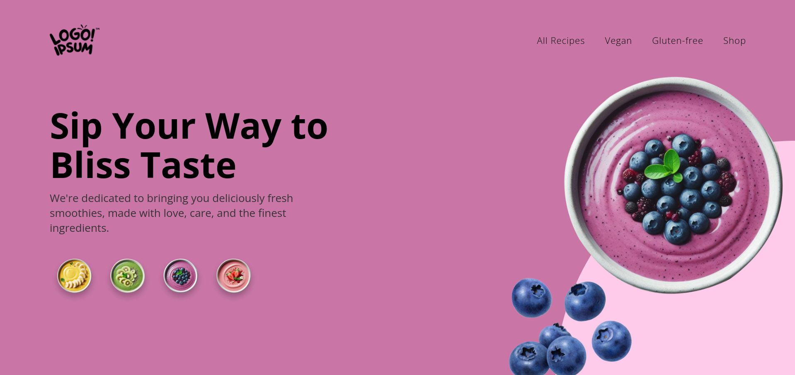

  

## 💻 Projeto

Este projeto é um tutorial da landing page **Smoothie Bowls** ao usar _HTML_, _CSS_ e _JavaScript_.

## 🚀 Tecnologias

- HTML
- CSS
- JavaScript

## 📔 Conhecimentos abordados

- [x] Uso semântico do HTML
- [x] Variáveis do css no `:root`
- [x] Animações
- [x] Uso do CSS Flexbox
- [x] Efeitos com a propriedade `transform` do css
- [x] Uso do método `:not` do css

## 📺 Tutorial no Youtube

